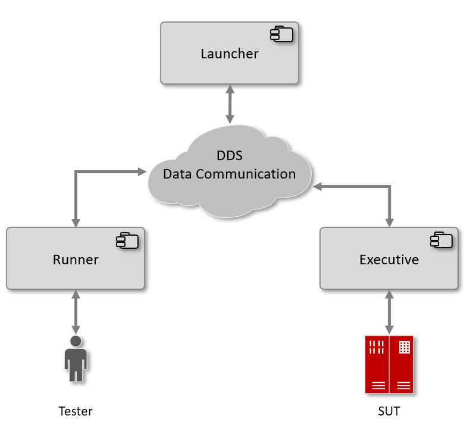
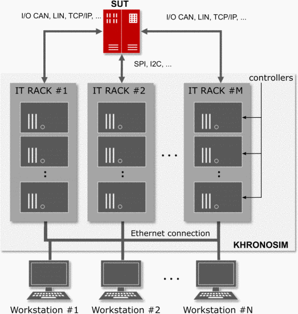
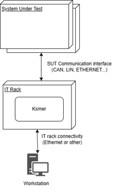
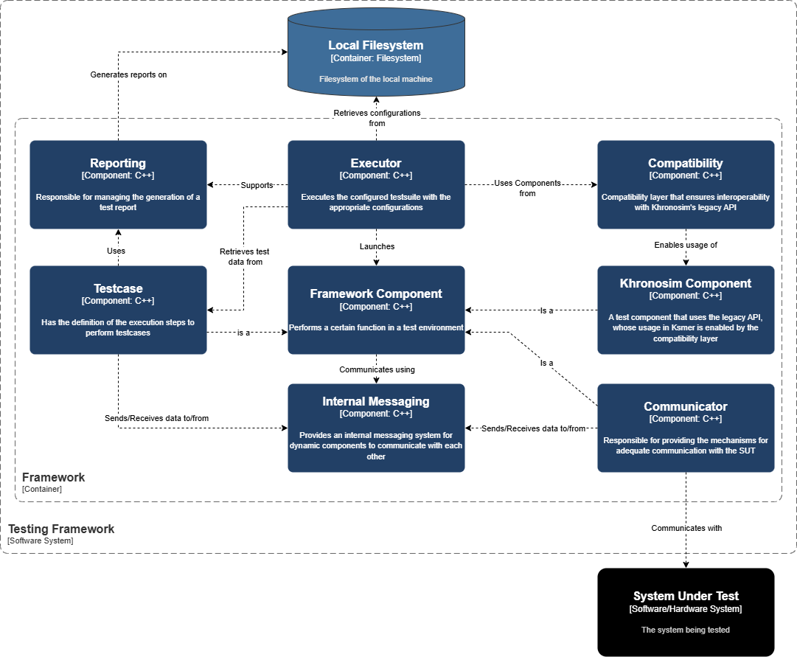
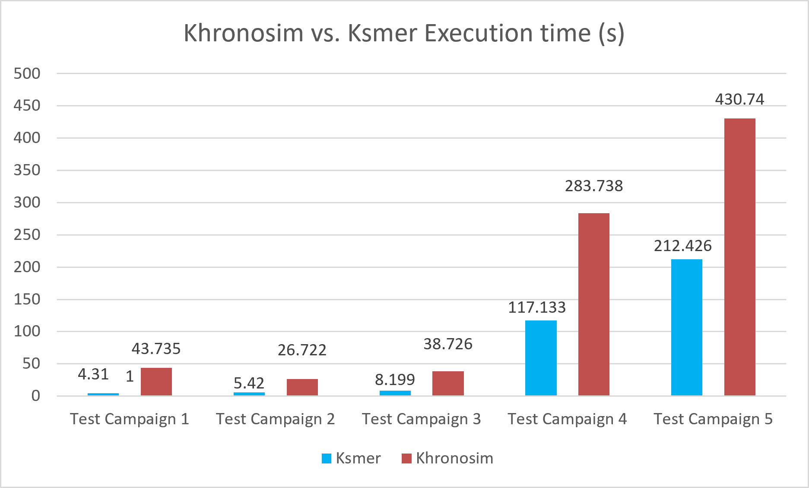
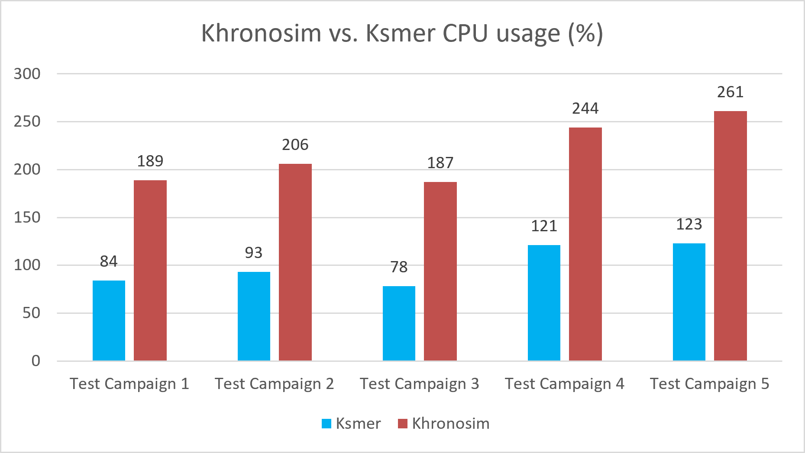

## Overview

Ksmer is a proof-of-concept project I developed during my internship at [Critical Software](https://www.criticalsoftware.com/) for the dissertation of the master's degree in Engineering of Critical Systems. It is a testing framework designed to suit the needs of many systems in safety-critical domains, such as railway, aerospace, automotive, and medical devices. Inheriting the core functionality of an existing framework, Khronosim, it takes a new architectural approach with the aim of improving tester experience, performance, and maintainability.

## Motivation

The motivation for testing frameworks in safety-critical systems stems from the rigorous testing requirements they have to ensure reliability and safety. In these domains, guaranteeing that software has a low probability of failure is crucial, as failures may result in serious consequences. Testing frameworks provide a structured approach to testing, enabling testers to create complex and modular test environments and execute test cases efficiently, as well as provide evidences for certification purposes. 

At Critical Software, an existing testing framework, Khronosim, has been successfully employed across several projects, however, it showed limitations in terms of performance and maintainability. It had initially developed over 20 years ago and had accumulated some technical debt from various iterations and modifications, often having been adapted to each specific project without clear versioning and feature evolution. Additionally, Khronosim's architecture was based on a distributed model, leveraging an implementation of DDS (Data Distribution Service) which introduced additional complexity and overhead. The goal of Ksmer was to address these limitations by experimenting the benefits that a monolithic architecture could bring to the framework, while still achieving the core functionality of Khronosim.

## Architecture and Technologies

Khronosim was based on three separate executables, communicating through DDS, each with a specific role:

- **Launcher**: the launcher functions as a manager of the connections to a system under test (SUT). Several runner applications may request access to the SUT simultaneously and it is the launcher’s responsibility to queue them, ensuring that there is only one active connection performing tests at a time.

- **Runner**: a runner application holds the information required to execute a specific test suite on the SUT and is instantiated by a tester.

- **Executive**: The executive application performs the actions requested by the runner on the SUT. It can be distributed across multiple machines, enabling the real-time execution of physically distributed SUT entities. It is instantiated by the launcher on behalf of a runner.

These components interact via DDS. The following diagrams illustrate this architecture:

  
  

Ksmer on the other hand is based on a single executable. It is designed to be run on a single machine, with the ability to connect to multiple SUTs simultaneously. The following diagram illustrates the proposed deployment and interaction with ksmer:

  

## Requirements, Features and Design

In order for a testing framework to be valuable, there are a few key features that it must provide:

- **Test case management**: The framework should allow testers to manage testsuites and test cases effectively. This includes the ability to configure test case parameters, expected outcomes, and any necessary setup or teardown procedures.

- **Test environment configuration**: The framework should provide mechanisms to create a desired test environment. It should be flexible enough to allow for the creation and extension of test entities, also known as components, which can serve various purposes, such as handling communication with the SUT, simulating input or system behavior, among others. The framework should also allow for the configuration of these entities, enabling testers to customize their parameters, for easier adaptation and reusability across different scenarios.

- **Decoupled component communication**: The framework should facilitate communication test entities in a decoupled manner, allowing them to interact without being tightly bound to each other. This promotes modularity and flexibility in the test environment, enabling testers to easily swap or modify components as needed.

- **Reporting, Logs and Analytics**: The framework should provide comprehensive reporting, logging and analytics capabilities based on test execution and respective failure/success results, allowing testers to analyze results, and provide evidence for auditing purposes.

Based on these requirements, Ksmer was developed using C++ and Autotools, and XML as the configuration format. The following diagram illustrates the initial software component design for Ksmer:

  

Essentially:

- The **Executor** is the main orchestrator and test manager of the framework. It is responsible for loading all test entities, managing test execution, and coordinating reporting.

- The **Framework Component** in the diagram represents the hierarchical structure of test entities. Components can be of various types, such as SUT connectors, such as the *Communicator*, which is responsible for handling communication with the SUT, the *Testcase*, which represents the test case structure, among others. The implementation of components is designed to be extensible, allowing testers to create new types of components as needed, by deriving from the framework-provided component classes, or creating new ones.

- The **Internal Messaging** is responsible for facilitating communication between components in a decoupled manner. It provides a publish-subscribe mechanism, allowing components to exchange messages without being tightly coupled to each other. This way, testers can easily swap or modify components without affecting the overall test environment.

- Finally, the **Reporting** component is responsible for collecting and managing test execution data, including results, logs, and analytics. It manages an XML structure that organizes the collected data and computed summaries and transforms it into a human-readable HTML format, for easier analysis.

## Evaluation and Results

In order to make a fair comparison between Khronosim and Ksmer, and given that this project was developed while a parallel railway testing project was underway at Critical Software, it was possible to use five independent test campaigns from this project to evaluate the performance of both frameworks. Their test suites were executed on the same machine, with the same configuration and parameters, and the report output was verified to be identical in both cases. The testsuites had the following characteristics:

- Test Campaign 1: 36 test cases, 62 total iterations.

-	Test Campaign 2: 15 test cases, 82 total iterations.

-	Test Campaign 3: 25 test cases, 87 total iterations.

-	Test Campaign 4: 92 test cases, 771 total iterations.

-	Test Campaign 5: 107 test cases, 792 total iterations.

The following table summarizes the results of the evaluation, which collected execution time and CPU usage for each test suite:

<figure style="display:flex; flex-direction:column; align-items:center; gap:10px;">
  
  <figcaption>
    Execution time results
  </figcaption>
</figure>

<figure style="display:flex; flex-direction:column; align-items:center; gap:10px;">
  
  <figcaption>
    CPU usage results
  </figcaption>
</figure>

The following table summarizes the improvements in execution time and CPU usage of Ksmer compared to Khronosim:

  <table>
    <tr>
      <th>Test Campaign  </th>
      <th>Ksmer Time</th>
      <th>Khronosim Time</th>
      <th>Improvement (%)</th>
      <th>Ksmer CPU</th>
      <th>Khronosim CPU</th>
      <th>Improvement (%)</th>
    </tr>
    <tr>
      <td>1</td>
      <td>4,310</td>
      <td>43,735</td>
      <td>90%</td>
      <td>82</td>
      <td>189</td>
      <td>57%</td>
    </tr>
    <tr>
      <td>2</td>
      <td>5,420</td>
      <td>26,722</td>
      <td>80%</td>
      <td>92</td>
      <td>206</td>
      <td>55%</td>
    </tr>
    <tr>
      <td>3</td>
      <td>8,199</td>
      <td>38,726</td>
      <td>79%</td>
      <td>80</td>
      <td>187</td>
      <td>57%</td>
    </tr>
    <tr>
      <td>4</td>
      <td>117,133</td>
      <td>283,738</td>
      <td>59%</td>
      <td>116</td>
      <td>244</td>
      <td>52%</td>
    </tr>
    <tr>
      <td>5</td>
      <td>212,426</td>
      <td>430,740</td>
      <td>51%</td>
      <td>120</td>
      <td>261</td>
      <td>54%</td>
    </tr>
  </table>

## Conclusion

In conclusion, Ksmer successfully demonstrated that, in the context of this project's use case, it can provide significant performance improvements over the existing framework. The results were very promising, showing significant improvements in both execution time and CPU usage, which ultimately translate to shorter test development cycles, test campaign execution times, and reduced resource consumption, which may permit the execution of more test campaigns in parallel, more complex test campaigns, or execute on more resource-constrained machines.

This project refreshed my knowledge of C++ and gave me the opportunity to learn and apply technologies that were new to me, such as the Autotools. It also provided me with valuable experience in designing and implementing a software framework, which I had never done before. It also allowed me to make design decisions, implement them, and evaluate their impact on the performance of the framework, which was a very rewarding experience.